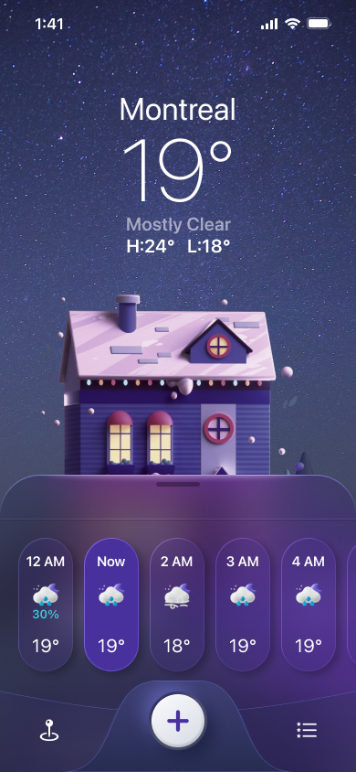
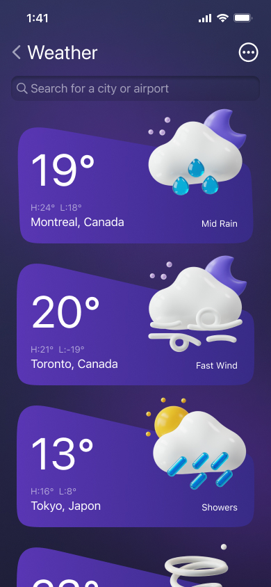

# React Native Weather App

Figma file: [Coffee Shop Mobile App Design](https://www.figma.com/community/file/1100826294536456295/weather-app-ui-design)

## Table of Contents

- [Video](#video)
- [Screenshots](#screenshots)
- [Features](#features)

## Video

<iframe src="https://drive.google.com/file/d/1VJSde9o6hKVjfxQlpeIqW3i8MvOSIDRi/preview" width="640" height="480" allow="autoplay"></iframe>

## Screenshots

  
  

## Features

- react-native-skia for drawing custom shapes and gradients
- reanimated 3
- blur effects
- react context
- typescript

---

> [!NOTE]  
> expo-prebuild
