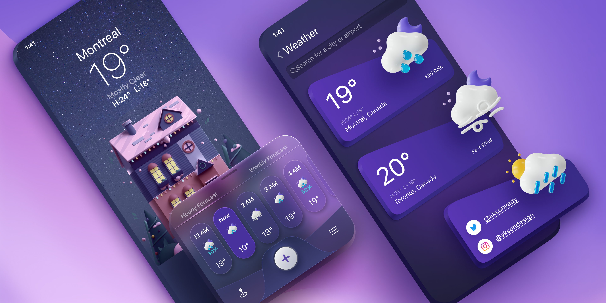

# React Native Weather App

Figma: [Weather App UI Design](https://www.figma.com/community/file/1100826294536456295/weather-app-ui-design)

## Table of Contents

- [Video](#video)
- [Screenshots](#screenshots)
- [Features](#features)

## Video

<iframe src="https://player.vimeo.com/video/912956417?badge=0&amp;autopause=0&amp;player_id=0&amp;app_id=58479" width="222" height="480" frameborder="0" allow="autoplay; fullscreen; picture-in-picture" title="Simulator Screen Recording - iPhone 13 mini - 2024-02-14 at 16.07.46"></iframe>

## Screenshots

  
  

## Features

- react-native-skia for drawing custom shapes and gradients
- reanimated 3
- blur effects
- react context
- typescript

---

> [!NOTE]  
> expo-prebuild
